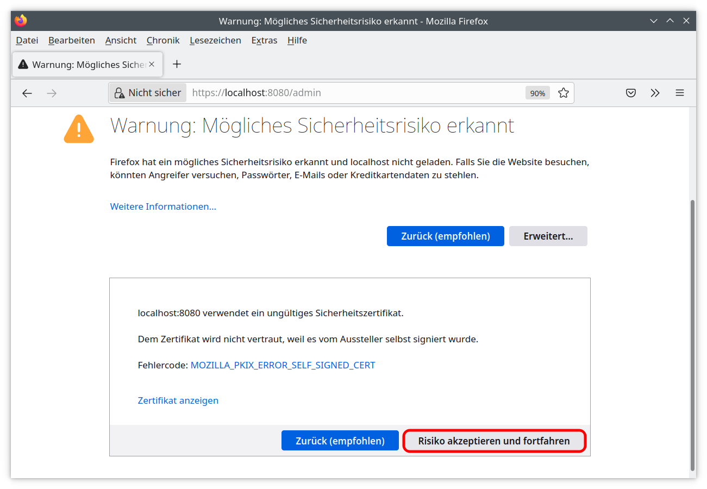

Erste Schritte
==============

.. only:: html

   .. contents::
      :depth: 2
   

Übersicht
---------

ooresults (open orienteering results) ist eine Software zur Erfassung und Auswertung
der Ergebnisse kleinerer Orientierungsläufe und ist in der Lage SPORTident Karten zu lesen.

Dabei steht "open" einerseits für "Open Source", andererseits für "Open Architecture".
ooresults ist unter der GNU AFFERO GENERAL PUBLIC LICENSE, Version 3, lizenziert.

ooresults besteht aus zwei Programmen:

1. **ooresults-server**

   ooresults-server ist ein Webserver zur Verwaltung und Speicherung der Daten. Er verwendet die TCP-Ports 8080 und 8081.

#. **ooresults-reader**

   ooresults-reader liest mit Hilfe einer angeschlossenen SPORTident-Auslesestation die Daten einer SI-Card
   und sendet die Daten zum ooresults-server.

Die Bedienung erfolgt mit Hilfe eines aktuellen Webbrowser (Chrome, Firefox, Edge, ...).

ooresults wurde bei der SILVA O-Night 2023 in München erfolgreich zur Auswertung der Ergebnisse eingesetzt.
Es hat folgende Eigenschaften:

- Multi-User-fähig
- Auslesen von SPORTident Karten
- Installation nur nur auf dem Server und Rechnern mit angeschlossener SPORTident Auslesestation notwendig,
  andere Computer benötigen nur einen aktuellen Webbrowser
- Unterstützt den Besuch von Posten in vorgegebener oder beliebiger Reihenfolge
- Unterstützt Score-OL
- Berechnung eines Gesamtergebnisses von mehreren Veranstaltungen
- Übernahme der Teilnehmerlisten eines Wettkampfes aus OrienteeringOnline.net über OE2003-CSV-Export
- Import von Teilnehmerlisten eines Wettkampfes im IOF 3.0 XML Format
- Import von Bahndaten im IOF 3.0 XML-Format (z.B. PurplePen)
- Export von Ergebnissen im IOF 3.0 XML-Format
- Erstellung von Ergebnislisten als PDF-Dateien

.. index:: Installation

Installation
------------

ooresults benötigt mindestens Python 3.8.
Der folgende Befehl installiert die neueste Version von ooresults und seine Abhängigkeiten aus dem Python Package Index:

.. code-block::

   python -m pip install ooresults

Es wird empfohlen ooresults in einer virtuellen Umgebung (venv) zu installieren.

.. index:: ooresults-server; Start

.. _start_server:

Start des ooresults-server
------------------------------

Der ooresults-server wird mit folgendem Befehl gestartet:

.. code-block::

   python -m ooresults.server

ooresults-server erzeugt ein Unterverzeichnis .ooresults im Heimverzeichnis des Benutzers,
falls dieses Verzeichnis noch nicht existiert.
Es enthält eine sqlite Datenbank und Konfigurationsdateien.
   
Alternativ kann der Reader auch direkt über das im Script-Verzeichnis der Python-Installation
befindliche ooresults-reader Program gestartet werden.

Für eine einfache Benutzung kann ein Desktop-Icon mit einer
Verknüpfung zu diesem Programm angelegt werden.

.. warning::

   Aus Sicherheitsgründen wird empfohlen, das Passwort des Admin Benutzers nach dem ersten Start
   des ooresults-reader zu ändern, siehe Kapitel :ref:`user_management`.

Alle Daten werden in der sqlite Datenbank-Datei ooresults.sqlite im Unterverzeichnis .ooresults
des Heimverzeichnisses des Benutzer gespeichert.
   
Durch Kopieren der Datei können die Daten gesichert oder auf einen anderen Rechner übertragen werden.
   

.. index:: ooresults-reader; Start

Start des ooresults-reader
------------------------------

Der ooresults-reader wird mit folgendem Befehl gestartet:

.. code-block::

   python -m ooresults.reader

Alternativ kann der Reader auch direkt über das im Script-Verzeichnis der Python-Installation
befindliche ooresults-reader Program gestartet werden.
   
Für eine einfache Benutzung kann ein Desktop-Icon mit einer
Verknüpfung zu diesem Programm angelegt werden.
      
.. warning::

   Der ooresults-reader verwendet das „extended“ Protokoll zum Lesen der SI-Cards.
   
   Wird die SPORTident-Auslesestation vor Beenden des ooresults-reader vom Rechner getrennt,
   wird die Auslesestation nicht auf das ursprünglich eingestellte Protokoll zurückgesetzt,
   und andere Softwareprodukte wie z.B OE2003 können nicht auf die Auslesestation zugreifen.
   Mit Hilfe des set-legacy-mode Programms kann die Auslesestation auf das „legacy“ Protokoll
   zurückgestellt werden:
   
   .. code-block::
   
      python -m ooresults.set_legacy_mode

Start der Bedienoberfläche
--------------------------

Die Bedienung erfolgt mit einem aktuellen Webbrowser durch Aufruf der Seite "https://localhost:8080".

Werden selbsterstellte Zertifikate für den Start des https-Servers verwendet,
müssen die Zugriffe auf "https://localhost:8080" **und** "https://localhost:8081"
als Ausnahmen im Webbrowser bestätigt werden:

.. image:: images/unsave_1_edited.png

