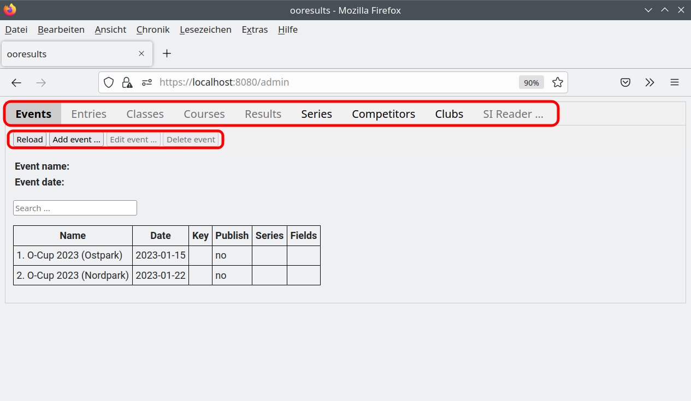
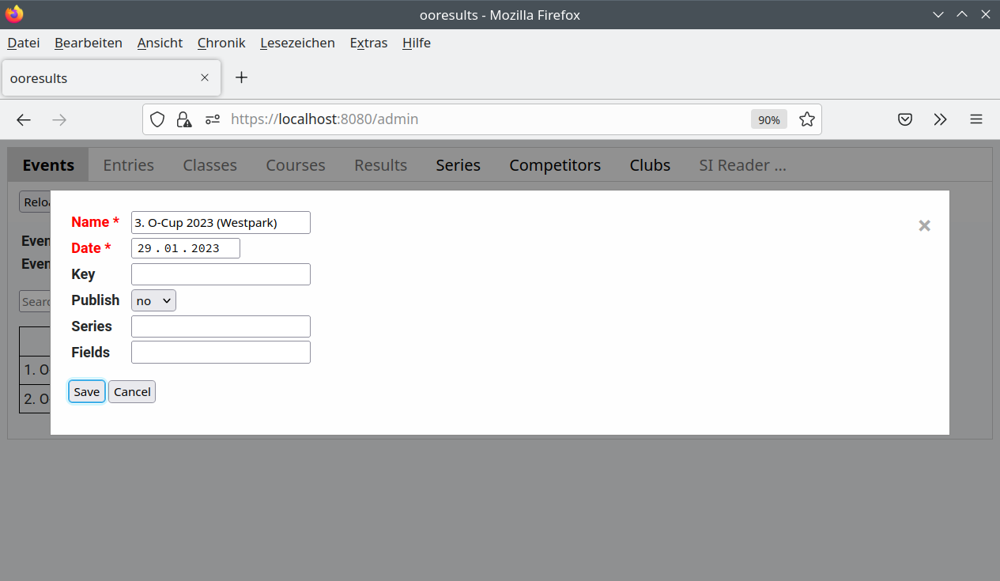
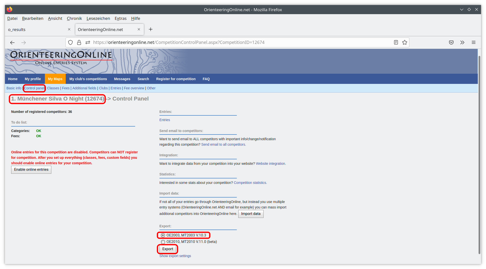
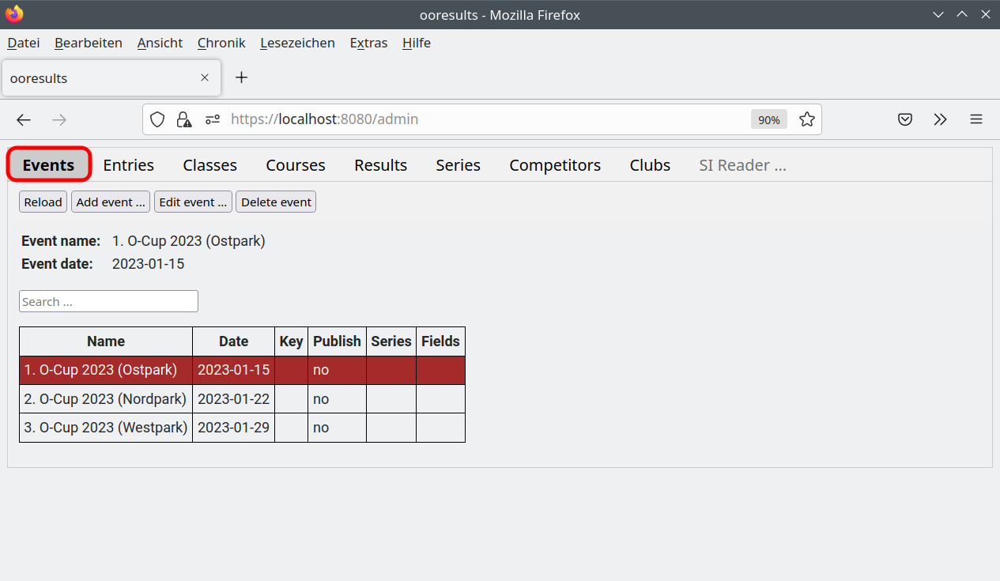
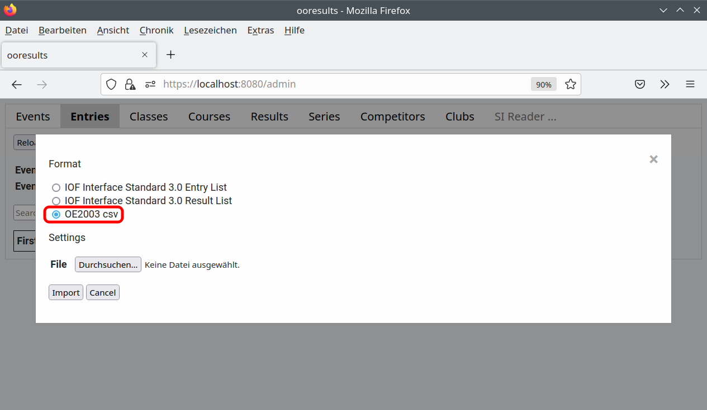
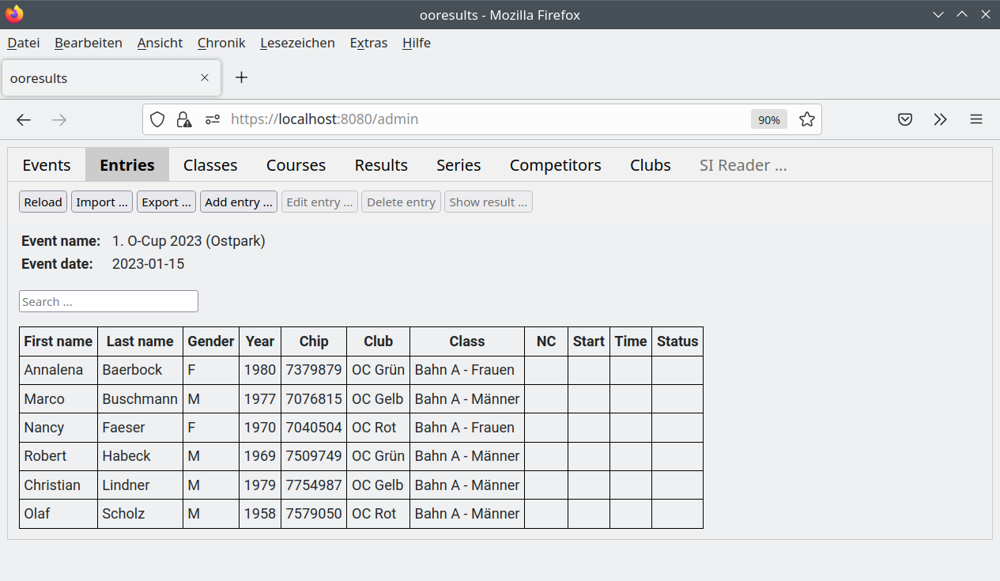
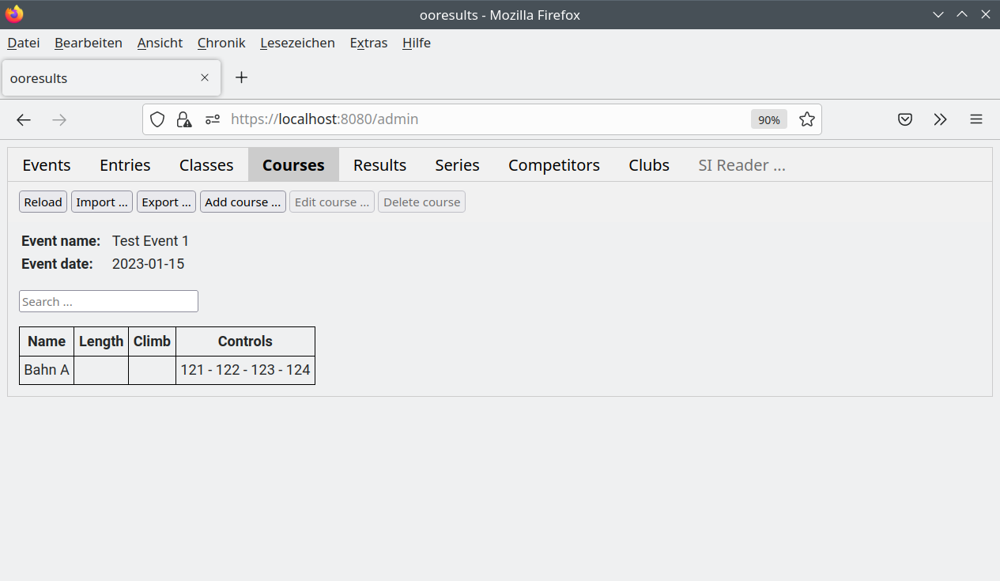
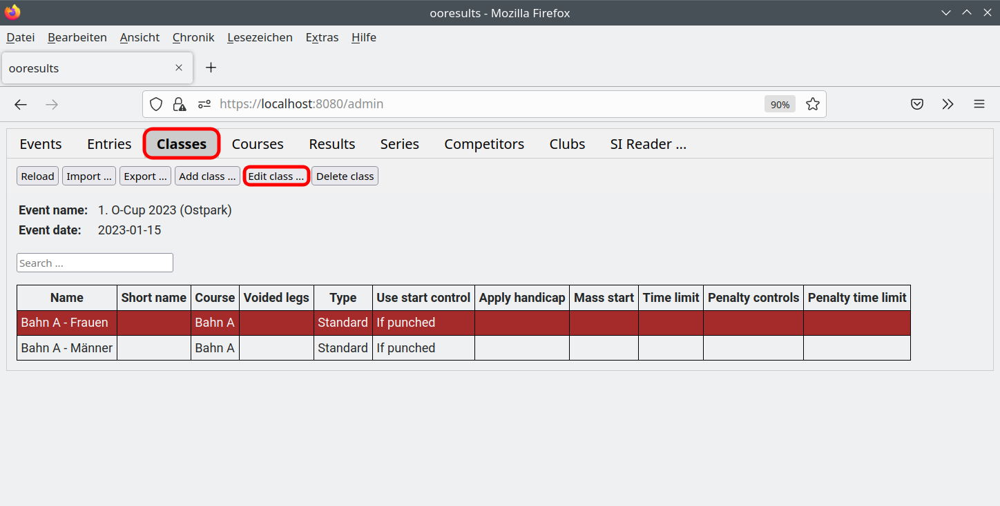
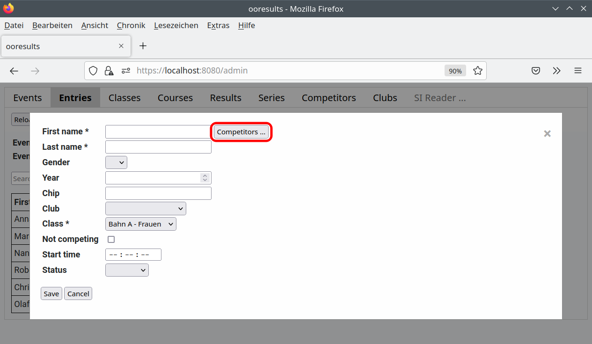

Tutorial - Teil 1
=================

.. only:: html

   .. contents::
      :depth: 2

Einloggen
---------

.. note::

   Im folgenden wird vorausgesetzt, dass der Webbrowser auf demselben Rechner gestartet wird,
   auf dem der ooresults-server läuft (zum Starten des ooresults-servers siehe Kapitel :ref:`start_server`.
   
   Ist dies nicht der Fall (läuft der ooresults-server auf einem anderen Rechner),
   ist anstelle von https://localhost:8080 eine andere Adresse und gegebenfalls
   auch ein anderer Benutzername und ein anderes Passwort zu verwenden. 

1. Starten des ooresults-server
#. Starten eines aktuellen Web-Browsers (Firefox, Chrome, ...)
#. Aufruf der Seite https://localhost:8080
#. Anklicken des Links Administration
#. Eingabe von Benutzernamen und Passwort

.. image:: images/login_1_edited.png

.. image:: images/login_2.png

Bei korrekter Eingabe von Benutzernamen und Passwort werden die bereits angelegten Wettkämpfe angezeigt.

.. image:: images/login_3.png

Die Änderung der Wettkampfdaten erfolgt über mehrere Registerblätter:

- Events (Wettkämpfe)
- Entries (Teilnehmer)
- Classes (Kategorien)
- Courses (Bahnen)
- Results (Ergebnisse)
- Competitors (Wettkämpfer)
- Clubs (Vereine)
- Series (Serien)

Die Daten der Registerblätter Events, Competitors, Clubs und Series sind wettkampfunabhängig
und gelten für alle Wettkämpfe.

Die Daten der Registerblätter Classes, Courses und Results sind wettkampfabhängig.
Auf diese Registerblätter kann nur zugegriffen werden, wenn zuvor im Registerblatt Events ein Wettkampf selektiert wurde.
Die angezeigten Daten beziehen sich dann auf diesen Wettkampf.

.. note::

   Hinzufügen, Ändern oder Löschen eines Datensatzes eines Registerblattes erfolgt durch Anklicken eines der ToolButtons.
   Einige Funktionen stehen erst zur Verfügung, nachdem ein Datensatz ausgewählt wurde.
   Der aktuell ausgewählte Datensatz wird mit rotem Hintergrund dargestellt.

Anlegen eines Wettkampfes
-------------------------

1. Anklicken des Registerblatts "Events"
#. Anklicken der Funktion "Add event ..."
#. Eingeben der Wettkampfdaten und bestätigen mit "OK". Verpflichtend auszufüllen sind Name und Datum.

.. image:: images/event_1_edited.png

.. note::

   **Für die meisten weiteren Schritte muss zuerst ein Wettkampf ausgewählt werden
   (Anklicken des Registerblatts Events und Anklicken des betreffenden Wettkampfes,
   der ausgewählte Wettkampf wird anschliessend mit roten Hintergrund angezeigt).**

Importieren von Teilnehmern
---------------------------

1. Exportieren der Teilnehmer-Daten in http://orienteeringonline.net/ im OE2003 Format.

   1. Aufruf von http://orienteeringonline.net
   #. Einloggen
   #. Wechseln zur Event-Seite
   #. Wechseln zum Control Panel Registerblatt
   #. Auswählen von Export nach OE2003
   #. Anklicken des Export-Buttons
   #. Speichern des Files, z.B als Export_OONet.txt

2. Anklicken des Registerblatts "Events"
3. Selektieren des Wettkampfs "1. O-Cup 2023 (Westpark)" (durch Anklicken)

4. Anklicken des Registerblatts "Entries"
5. Anklicken der Funktion "Import ..."

.. image:: images/import_entries_3_edited.png

6. Auswählen "OE2003"
7. Auswählen des zuvor im Schritt 1 exportierten Files
8. Bestätigen mit "Import"

Es werden nun die importierten Teilnehmer angezeigt:

Noch nicht vorhandende Vereine und Läufer werden automatisch erzeugt und unter "Competitors" und "Clubs" angezeigt.
Noch nicht vorhandene Kategorien werden ebenfalls automatisch erzeugt.
   
.. warning::

   Im OrienteeringOnline Export ist das Geschlecht der Teilnehmer nicht enthalten. Da es für die Handicap-Berechnung benötigt wird,
   ist es nachträglich durch Editieren der Teilnehmer zu ergänzen.
   
   Ist der Teilnehmer bereits im Registerblatt "Competitors"
   (z.B. durch Teilnahme an einem früheren Wettkampf) enthalten, wird das Geschlecht beim Import von dort automatisch übernommen.

.. warning::

   Für den OE2003 Export aus OrienteeringOnline werden spezielle Rechte in OrienteeringOnline benötigt.

Anlegen der Bahnen
------------------

1. Anklicken des Registerblatts "Courses"
#. Anklicken der Funktion "Add course ..."
#. Eingeben der Bahndaten. Auszufüllen sind mindestens der Name und die Nummern der Kontrollstationen.
#. Anklicken von "Save"

.. image:: images/course_1.png

Die Kontrollstationen werden durch Bindestrich getrennt eingegeben.
Zur besseren Lesbarkeit können vor und nach dem Bindestrich Leerzeichen (Space) eingegeben werden.

Für die Tutorial-Wettkämpfe wird eine Bahn mit den Kontrollstationen "121-124-122-123" benötigt:

Anlegen der Kategorien
----------------------

Die beim Import der Teilnehmer-Daten aus orienteeringonline.net
automatisch angelegten Kategorien müssen noch um weitere Daten ergänzt werden.

1. Anklicken des Registerblatts "Classes"
#. Selektieren der zu editierenden Kategorie
#. Anklicken der Funktion "Edit class ..."
#. Eingeben der fehlenden Kategoriendaten
#. Anklicken von "Save"

.. image:: images/class_2.png

.. warning::

   Der Name Organizer kann nicht als Wettkampfkategorie verwendet werden. Teilnehmer, die dieser Kategorie zugeordnet sind,
   erhalten einen Veranstalterbonus bei Serien, und werden nicht in Start- und Ergebnislisten aufgeführt.

Für die Tutorial-Wettkämpfe werden folgende Kategorien verwendet:

.. image:: images/class_3.png

.. seealso::

   Eine Beschreibung der Datenfelder befindet sich in Kapitel :ref:`classes`.

.. _add_entry:

Manuelles Anlegen von Teilnehmern
---------------------------------

1. Anklicken des Registerblatts "Entries"
#. Anklicken der Funktion "Add entry ..."
#. Eingeben der Teilnehmerdaten. Verpflichtend auszufüllen sind Vor- und Nachname und Kategorie.
#. Bestätigen mit "Save"

.. warning::

   Sind der Verein oder die Kategorie nicht in der Auswahlliste enthalten,
   sind sie **vorher** über die Seiten "Clubs" bzw. "Classes" anzulegen.

Existiert der Läufer noch nicht in der "Competitors" Liste, wird er dort automatisch ergänzt.

Falls der Läufer bereits in der "Competitors" Liste existiert
(z.B. weil er bereits an einem früheren Lauf teilgenommen hat),
kann man den Button "Competitors ..." (rechts neben dem Feld "First name") drücken.

Es öffnet sich ein Fenster mit der Competitors-Liste.
Durch Anklicken und Betätigen von "Save" können die Daten direkt in das "Add entry ..." Formular übernommen werden.
Dabei kann die Competitors-Liste durch Filtern (Search ... Feld) verkleinert werden.

Editieren und Löschen von Teilnehmern
-------------------------------------

Die Editierfunktion wird vor allem benötigt zum Ergänzen oder Ändern von SI-Card Nummern und zum Ändern des Status
(z.B  zum Setzen des Status DNS für nicht angetretene Teilnehmer)

1. Anklicken des Registerblatts "Entries"
2. Selektieren des gewünschten Teilnehmers in der Tabelle.
   Die Zeile wird dann mit roten Hintergrund angezeigt.
   Durch Verwendung des Filters (Search ... Feld) kann die Liste verkleinert werden.
   **Besonders geeignet als Filterkriterium ist das Geburtsjahr.**

.. image:: images/competitor_2_edited.png

3. Anklicken der Funktion "Edit entry ..." bzw. "Delete entry ...
4. Bei "Edit entry ...": Ändern der Teilnehmerdaten
5. Bestätigen mit "Save" bzw. "Delete"

.. warning::

   Vorname, Nachname, Geschlecht und Geburtsjahr sind unveränderliche Eigenschaften eines Teilnehmers. Werden sie geändert,
   so werden sie bei **allen** (auch bereits beendeten) Wettkämfen geändert. Bei Verwendung des Handicap-Faktors kann dies
   zu einer Änderung der Wertung führen.
