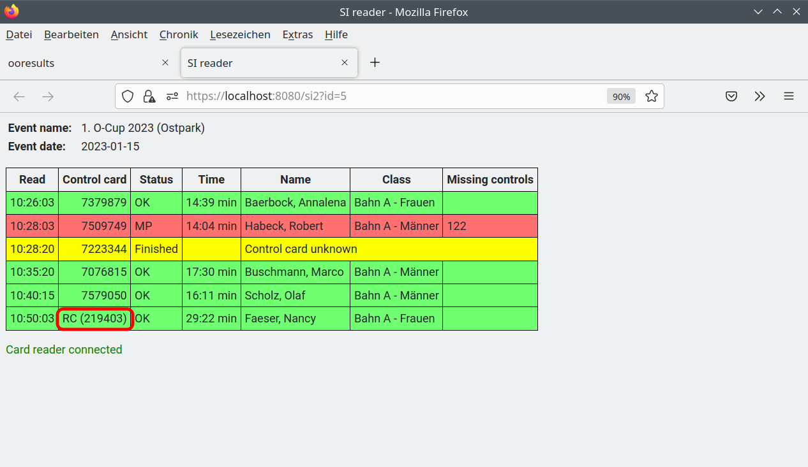

Weitere Funktionen
==================

.. only:: html

   .. contents::
      :depth: 2

.. _rental_cards:

Ausleihbare SPORTident Karten
-----------------------------

Um die Verwaltung ausgeliehener SPORTident Karten zu erleichtern,
können ausleihbare Karten in einer Datei rental_cards.txt erfasst werden.
Die Datei wird im Unterverzeichnis .ooresults des Heimverzeichnisses des Benutzers gesucht
und enthält pro Zeile die Nummer einer SPORTident Karte.

.. code-block::

   219402
   219403
   219412

Ist die Nummer einer von einem Teilnehmer verwendeten SPORTident Karte in dieser Datei enthalten,
wird sie in den Tabellen der Registerblätter "Entries" und "SI Cardreader" in den entsprechenden Spalten
als "RC (...)" dargestellt (RC = rental card).

.. warning::

   Die Datei rental_cards.txt wird nur einmal während des Starts des ooresult-server gelesen.
   Sollen nach einer Änderung der Datei die geänderten Daten verwendet werden,
   muss der ooresult-server beendet und neu gestartet werden.
