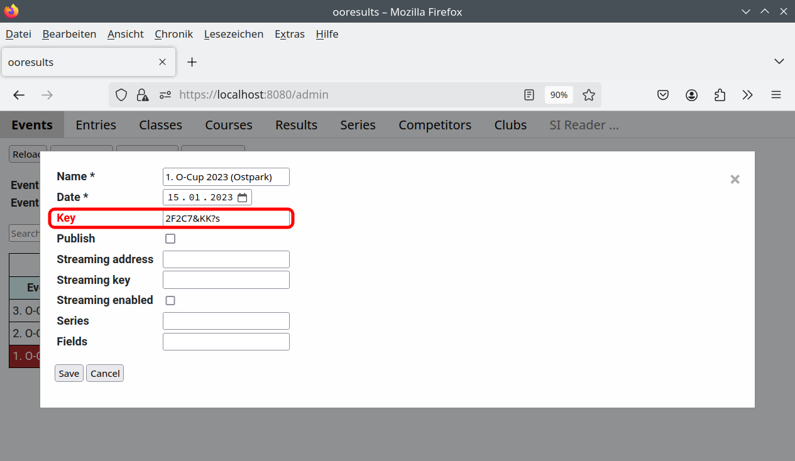
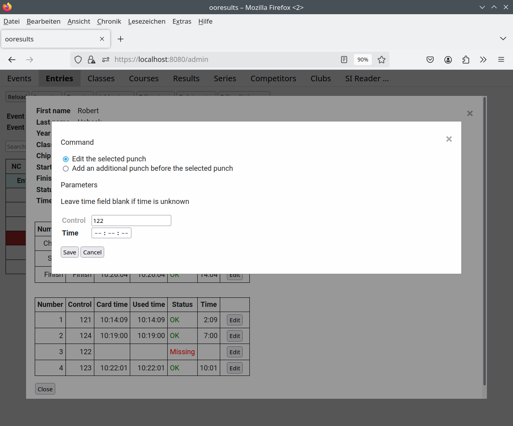

Tutorial - Teil 2
=================

.. only:: html

   .. contents::
      :depth: 2

Auslesen der SI-Cards
---------------------

Das Auslesen der SI-Cards mit Hilfe der SPORTident Auslesestation erfolgt über das Programm ooresults-reader.
Es kann auf demselben Rechner wie der ooresults-server oder einem beliebigen anderen Rechner gestartet werden.

Der ooresults-reader liest beim Start aus einer Konfigurationsdatei einen Schlüssel,
den er mit den von der SI-Card gelesenen Daten zum ooresults-server sendet.
Der ooresults-server ordnet die Daten dem Wettkampf zu, dessen Schlüssel mit dem empfangenen Schlüssel übereinstimmt
(oder verwirft die Daten, falls dieser Schlüssel bei keinem Wettkampf angegeben wurde).

.. 2F2C7&KK?s

.. warning::

   Der Schlüssel dient nicht nur der Zuordnung der Daten zu einem Wettkampf, sondern auch als Nachweis der Zugangsberechtigung
   des Leseprogramms. Nur das Leseprogramm, das den Wettkampfschlüssel kennt, kann SI-Card Daten in der Datenbank speichern.
   Der Schlüssel ist daher wie ein Passwort geheimzuhalten und sollte üblichen Passwortrichtlinien entsprechen.

Da der Schlüssel wie ein Passwort zu handhaben ist, wird er in der Events-Tabelle mit \*\*\* angezeigt. Um den Schlüssel zu lesen,
ist die Edit-Funktion des Events aufzurufen.

   
Aus Sicherheitsgründen sollte nur bei dem Wettkampf ein Schlüssel angegeben werden, der gerade veranstaltet wird.
Nach Ende des Wettkampfes sollte der Schlüssel gelöscht und beim nächsten Wettkampf ein anderer Schlüssel verwendet werden.
   
Laufen ooresults-server und ooresults-reader auf demselben Rechner **und** und ist der Rechner nicht mit einem Netzwerk verbunden,
kann auch ein einfacher Schlüssel wie z.B "local" verwendet werden.

.. warning::

   Der ooresults-reader verwendet das „extended“ Protokoll zum Lesen der SI-Cards.
   
   Wird die SPORTident-Auslesestation vor Beenden des ooresults-reader vom Rechner getrennt,
   wird die Auslesestation nicht auf das ursprünglich eingestellte Protokoll zurückgesetzt,
   und andere Softwareprodukte wie z.B OE2003 können nicht auf die Auslesestation zugreifen.
   Mit Hilfe des set-legacy-mode Programms kann die Auslesestation auf das „legacy“ Protokoll
   zurückgestellt werden.

   
Anzeige der gelesenen SI-Card Daten
-----------------------------------

1. Anklicken des Registerblatts "SI CardReader ..."

Es wird ein neuer Tab im Browser geöffnet, in dem alle gelesenen SI-Cards zum selektierten Wettkampf
seit Serverstart angezeigt werden.

Wird eine SI-Card gelesen, wird automatisch geprüft, ob die gelesene SI-Card Nummer eindeutig einem beim betreffenen Wettkampf
registriertem Läufer zugeordnet werden kann.

Ist dies der Fall, wird das Ergebnis beim Läufer gespeichert und
die Laufzeit zusammen mit dem Läufernamen bei einem erfolgreichen Lauf (Status OK) auf einem
grünen oder bei Fehlstempel (Status MP oder DNF) auf einem roten Hintergrund angezeigt.

Kann die gelesene SI-Card nicht eindeutig einem Läufer zugeordnet werden, oder ist dem Läufer bereits ein anderes Ergebnis
zugeordnet, wird kein Läufername und anstelle der Laufzeit und des Status eine Begründung angezeigt,
weshalb keine Zuordnung zu einem Läufer möglich ist. Der Eintrag erfolgt auf gelben Hintergrund.

.. image:: images/sireader_1.png

In folgenden Fällen ist keine Zuordnung der SI-Card zu einem Läufer möglich:

- Es existiert kein Läufer mit dieser SI-Card
- Es existiert genau ein Läufer mit dieser SI-Card, aber dem Läufer wurde bereits ein (anderes) Ergebnis zugeordnet
- Es existieren mehrere Läufer mit dieser SI-Card

Wird eine SI-Card mehrfach, aber mit gleichen Einträgen, gelesen (d.h. es wurde nach dem ersten Auslesen
**keine** weitere Kontrollstation gestempelt), wird kein neuer Eintrag in der "Entries" Liste angelegt.

Am Ende der Seite wird der Status der Auslesestation angezeigt:

.. image:: images/sireader_2_edited.png

Dabei bedeuten:

- Offline

  Die Webseite hat keine Verbindung zum ooresults-server.
   
- Card reader offline

  Es wurde noch keine Verbindung zu einem ooresults-reader hergestellt,
  der den Schlüssel des Wettkampfes verwendet.
   
- Card reader disconnected

  Es wurde eine Verbindung zu einem ooresults-reader hergestellt,
  der den gleichen Wettkampfschlüssel verwendet.
  Es ist aber noch keine PortIdent-Auslesestation angeschlossen,
  oder die SPORTident-Auslesestation wurde vom ooresults-reader nicht erkannt.

- Card reader connected

  Es wurde eine Verbindung zu einem ooresults-reader hergestellt,
  der den gleichen Wettkampfschlüssel verwendet,
  und eine SPORTident-Auslesestation ist angeschlossen und betriebsbereit.

.. note::

   Nach einem Neustart des Servers ist das "SI CardReader" Fenster leer.

Kann die gelesene SI-Card keinem Läufer zugeordnet werden, wird das Ergebnis als neuer Eintrag (ohne Läufernamen)
auf der Seite "Entries" angezeigt:

.. note::

   Im Gegensatz zum "SI CardReader" Fenster wird das "Entries" Fenster nicht automatisch beim Einlesen einer SI-Card,
   sondern erst nach Aufruf der "Reload" Funktion aktualisiert.

Manuelles Zuordnen einer gelesenen SI-Card zu einem Läufer
----------------------------------------------------------

Kann eine gelesene SI-Card nicht automatisch einem Läufer zugeordnet werden,
muss das Ergebnis manuell einem Läufer zugeordnet werden.

1. Anklicken des Registerblatts "Entries"
#. Selektieren des Läufers, dem das Ergebnis zugeordnet werden soll.
   Mit Hilfe der Filter-Funktion kann die Liste verkleinert werden.
#. Anklicken der Funktion "Edit entry ..."
#. Öffnen der Result-Liste und Auswahl eines der nicht zuordbaren SI-Card Einträge
#. Bestätigen mit "Save"

Ist dem Läufer noch kein Ergebnis zugeordnet, wird der SI-Card Eintrag in der "Entries" Liste gelöscht.
   
Ist dem Läufer bereits ein Ergebnis zugeordnet, wird das vorhandene Ergebnis als neues nicht zuordbares Ergebnis
in der "Entries" Liste gespeichert. Dies erfolgt, um das Szenario "zwei Läufer haben ihre SI-Cards vertauscht"
behandeln zu können.

.. warning::

   Ist der Läufer noch nicht für den Lauf registriert, muss er zuvor angelegt werden,
   siehe Kapitel :ref:`add_entry`.

   
Manuelles Entfernen eines einem Läufer zugeordneten Ergebnis
------------------------------------------------------------

Manchmal kann es notwendig sein, ein einem Läufer zugeordnetes Ergebnis wieder von diesem Läufer zu entfernen.
Das Ergebnis wird dann als nicht zuordbares Ergebnis in der "Entries" Liste gespeichert.

1. Selektieren des Läufers in der "Entries" Liste.
   Mit Hilfe der Filter-Funktion kann die Liste verkleinert werden.
#. Anklicken der Funktion "Edit entry ..."
#. Öffnen der Ergebnis-Liste und Auswahl "Remove result"
#. Bestätigen mit "Save"

Nicht zuordbare und nicht mehr benötigte Ergebnis-Einträge können aus der "Entries" Liste
mit Hilfe der Funktion "Delete entry" gelöscht werden.

.. note::

   Der Eintrag "Remove result" wird nur angezeigt, wenn dem Läufer ein Ergebnis zugeordnet ist.

Ändern des Status eines Läufers
----------------------------------------

Dies erfolgt mit der Funktion "Edit entry ...".

1. Selektieren des Läufers in der "Entries" Liste.
   Mit Hilfe der Filter-Funktion kann die Liste verkleinert werden.
#. Anklicken der Funktion "Edit entry ..."
#. Öffnen der Status-Liste und Auswahl eines Status
#. Bestätigen mit "Save"

.. seealso::

   Eine Beschreibung der möglichen Zustände findet sich in Kapitel :ref:`entries`.

Anzeigen und Editieren der Ergebnisse eines Läufers
---------------------------------------------------

1. Selektieren des Läufers in der "Entries" Liste.
   Mit Hilfe der Filter-Funktion kann die Liste verkleinert werden.
#. Anklicken der Funktion "Edit split times ..."

Sollte eine Kontrollstation nicht funktionieren und trotz ordnungsgemäßem Stempeln nicht
auf der SI-Card des Läufers enthalten sein, ist wie folgt vorzugehen:

1. Anklicken der Funktion "Edit" am Ende der Zeile des betreffenden Postens
#. Eingabe der Stempelzeit (falls diese nicht bekannt ist bleibt das Feld leer)
#. Bestätigen mit "Save"

Für die Ergebnisberechung wird die in Spalte "Used time" angezeigte Zeit verwendet.
Zeilen, die editiert wurden, in denen also die von der SI-Card gelesene Zeit (Spalte "Card time")
von der verwendeten Zeit (Spalte "Used time") abweicht, werden grau hinterlegt angezeigt.

Verwendung des Selbsteinlesefensters
------------------------------------

Die ooresults Software ist für ein selbstständiges Auslesen der SI-Card durch einen Läufer konzipiert,
.d.h. der Läufer steckt seine SI-Card in die SPORTident-Auslesestation und bekommt
sein Ergebnis auf einem (zusätzlichen) Bildschirm angezeigt (hierzu eignet sich auch ein SmartPhone).

Kann die SI-Card keinem Läufer zugeordnet werden, erscheint der Hinweis, sich im Wettkampfzentrum zu melden.
Dort kann dann das Ergebnis einem Läufer zugeordnet werden.

Entspricht der angezeigte Name nicht dem Namen des Läufers (z.B. weil zwei Läufer ihre SI-Cards vertauscht haben),
wendet sich der Läufer zur Korrektur ebenfalls ans Wettkampfzentrum.

1. Öffnen eines Web-Browsers Fensters
#. Aufruf der Seite https://localhost:8080/si1

.. image:: images/si1_1_edited.png

.. note::

   Haben mehrere Wettkämpfe einen Schlüssel,
   so wird der erste Wettkampf der "Events" Liste mit einem Schlüssel verwendet.
 

.. _demo_cardreader:

Demo-CardReader
---------------

Wird der ooresults-server in einem Demo-Modus gestartet, kann das Auslesen von SI-Cards mit einem
Demo-CardReader simuliert werden.

1. Öffnen eines Web-Browsers Fensters
#. Aufruf der Seite https://localhost:8080/demo
#. Eingabe des Wettkampfschlüssels
#. Eingabe der Posten und Stempelzeiten
#. Eingabe der SI-Card Nummer
#. Versenden des Ergebnisses an den ooresults-server durch Drücken von "Insert card"

.. image:: images/demo_1_edited.png

.. note::
 
   - Es werden nur Zeilen mit einer Postennummer **und** einer Stempelzeit verwendet.

   - Der Demo-Reader ergänzt als Datum automatisch das Datum des Wettkampfes.

   - Da der ooresults-reader den Schlüssel nur beim Programmstart liest, sollte vor Änderung des Schlüssels
     die Webseite neu geladen werden
