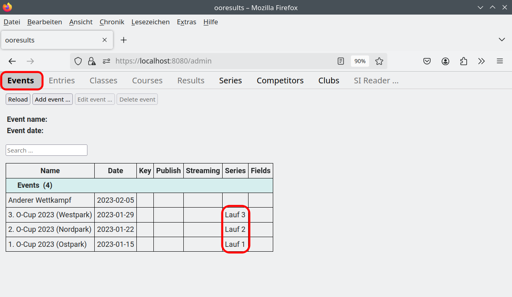

Tutorial - Teil 3
=================

.. only:: html

   .. contents::
      :depth: 2

Anzeige der Ergebnisse
----------------------

1. Anklicken des Registerblatts "Results"

Mit den Funktionen "Print results ..." bzw. "Print split times ... " können PDF-Dateien
mit den Ergebnissen bzw. Zwischenzeiten erstellt werden.

.. image:: images/results_1_edited.png

.. note::

   Ein Exportieren der Ergebnisse in verschiedene Formate (einschliesslich IOF XML 3.0 ResultList)
   ist über die Funktion "Export ..." im Registerblatt "Entries" möglich.

Berechnung und Anzeige des Gesamtergebnis
-----------------------------------------

Wettkämpfe mit einem Eintrag im Feld "Series" werden zu einem Gesamtergebnis zusammengefasst.
Das Gesamtergebnis wird im Registerblatt "Series" angezeigt, dabei werden die Wettkämpfe zeitlich sortiert,
und als Überschriften die im Feld "Series" angegebenen Texte verwendet.

.. image:: images/series_2_edited.png

.. note::

   Es lässt sich derzeit pro Datenbank nur ein Gesamtergebnis berechnen.
   
.. warning::

   Die Teilnehmer werden durch ihren Vor- und Zunamen identifiziert.
   Unterschiedliche Schreibweisen eines Teilnehmers in verschiedenen Wettkämpfen werden nicht automatisch erkannt,
   z.B. bilden "Annalena Baerbock" und "Anna-Lena Baerbock" im Gesamtergebnis zwei Einträge.

Die Berechnung des Gesamtergebnis wird im "Settings" Dialog festgelegt. Der "Settings" Dialog wird über
die Funktion "Settings ..." geöffnet.

.. image:: images/settings_1.png

.. seealso::

   Eine Beschreibung der Felder befindet sich im Kapitel :ref:`settings`.

Veranstalterbonus
-----------------

Teilnehmer, die in einem Wettkampf der Kategorie "Organizer" zugeordnet sind,
erhalten für diesen Wettkampf einen Veranstalterbonus. Er beträgt 50% des Punkte-Ergebnisses
bei Teilnahme an einem Lauf, ansonsten ist es der Durchschnitt der beiden besten Punkte-Ergebnisse.

.. warning::

   Die Kategorie "Organizer" erscheint nicht in Start- und Ergebnislisten und kann daher nicht als
   Wettkampfkategorie verwendet werden.
