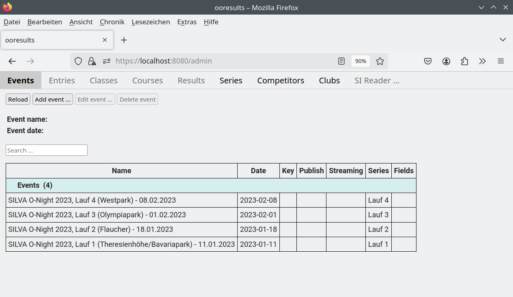

Tutorial - SILVA O-Night
========================

.. only:: html

   .. contents::
      :depth: 2

Die Silva O-Night ist eine Wettkampfserie bestehend aus vier Wettkämpfen.

Die Wettkämpfe werden als Postennetz (freie Wahl der Postenreihenfolge) mit Massenstart und Zeitlimit in
drei Kategorien (Männer, Frauen, Kinder) durchgeführt. Für jeden nicht besuchten Posten und für Überschreiten
des Zeitlimits werden Strafzeiten zur Laufzeit addiert.
Die Gesamtzeit wird noch mit einem alters- und geschlechtsabhängigen Faktor multipliziert.

Für das Gesamtergebnis werden die besten drei Läufe berücksichtigt.

Nachstehend sind die bei der SILVA O-Night 2023 verwendeten Einstellungen beschrieben.

Wettkämpfe
----------

Bahnen
------

Für die Silva O-Night werden zwei Bahnen benötigt:

* "Bahn A" mit den Kontrollstationen "121-122-123-124-125-126-127-128-129-130-131-132-133-134-135"
* "Bahn C" mit den Kontrollstationen "121-122-123-124-125-126"

Kategorien
----------

Gesamtergebnis
--------------

